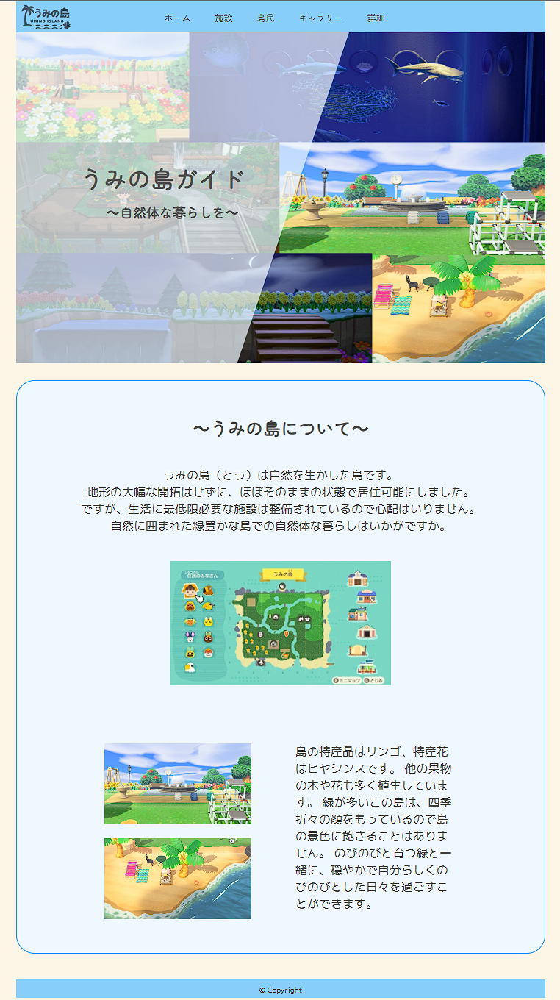
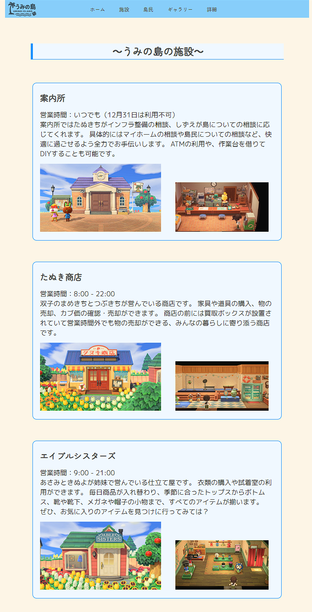
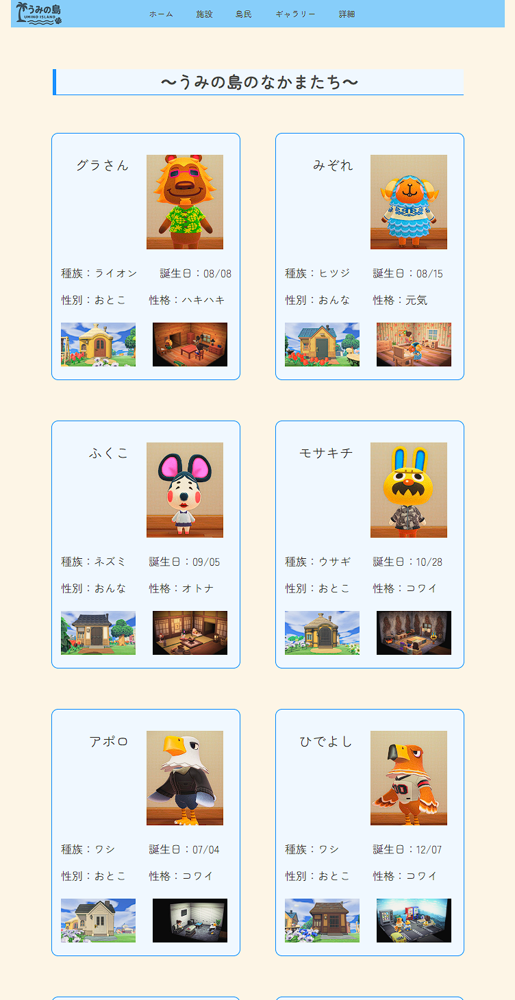
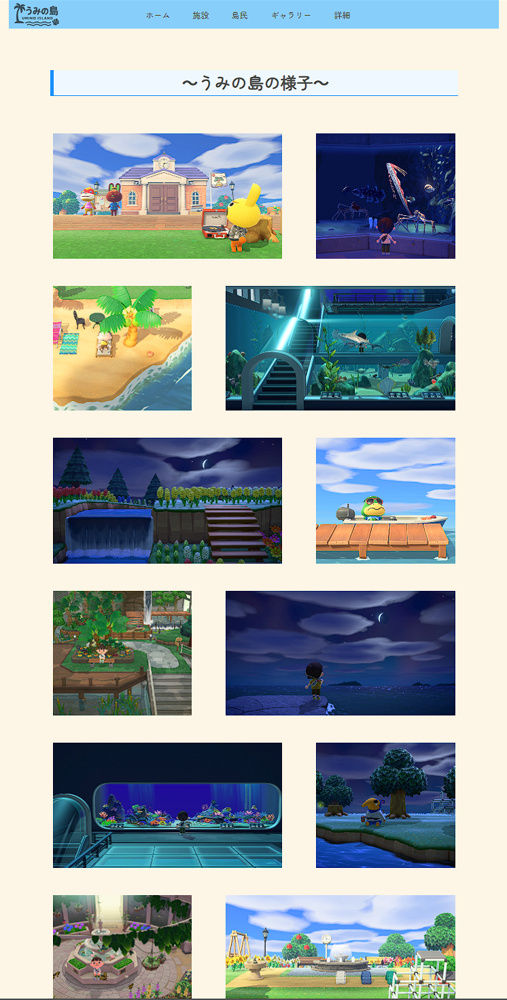
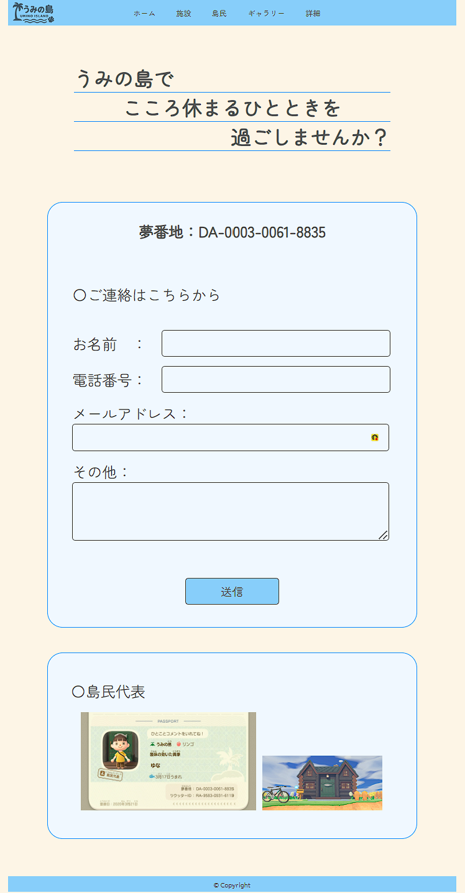

# うみの島ガイド

## サイトURL
https://yuna031706.github.io/UminoSite/

## サイト画面
| トップページ                                     | 施設ページ                      | 島民ページ                         |
| ----------------------------------------- | ---------------------------------- | ---------------------------------------- |
|  |  |  |

| ギャラリーページ                        | 詳細ページ                       |
| ----------------------------------------- | ---------------------------------- |
|  |  |

## 概要
自分の「あつまれどうぶつの森」の島を紹介するWebサイトです。  
島の施設や島民、雰囲気などを紹介しています。

## 制作目的
Webサイト構築の学習の一環として制作しました。  
Figmaを利用したワイヤーフレーム、デザインカンプの作成からコーディングまでのWebサイト制作の流れを学習することを目的としています。

## 使用技術
 - Figma（ワイヤーフレーム・デザインカンプ作成）
 - HTML
 - CSS

## ページ構成

### トップページ
島の概要や雰囲気を紹介するページです。

### 施設ページ
島にある施設や場所を紹介しています。

### 島民ページ
島に住んでいる住民を紹介するページです。

### ギャラリーページ
島の景色や様子を写真で紹介しています。

### 詳細ページ
お問い合わせフォームや島民代表の紹介を掲載しています。

## 工夫した点
 - 島の雰囲気が伝わるように画像を多く使用しました。
 - 実際の島を知ってもらうために、ゲーム内で撮影した画像を使用しています。
 - 見やすいレイアウトになるようにデザインを工夫しました

## 実行方法
index.htmlをブラウザで開いてください。  
スマートフォン対応は行っていないため、PCでの閲覧を推奨しています。

## 制作人数
1人

## 制作時期
2年前期に制作

## 制作期間
授業の単位認定課題として制作  
5コマ（7.5時間）  
7コマ（10.5時間）

